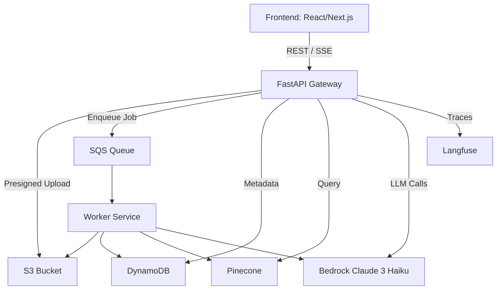

# 📘 DocFlow AI – Proof of Concept

A minimal, production-flavored **Proof of Concept (POC)** that demonstrates how to build a document-aware question answering system using AWS services, Pinecone, and modern frontend/backend tools.

This project is designed to **showcase end-to-end architecture skills** with the AWS + LLM ecosystem, while staying simple and easy to run.

---

## 🎯 Goals

- End-to-end demo of **document ingestion → search → RAG chat**  
- Hands-on with **FastAPI, AWS (S3, SQS, DynamoDB, Bedrock), Pinecone, React/Next.js**  
- Traced with **Langfuse** for observability  
- Lightweight, portable, and developer-friendly  

---

## 🏗️ Architecture Overview



---

## 🔄 Main Flows

### 1. Upload & Ingest
1. Frontend requests presigned URL from FastAPI.  
2. File is uploaded to S3.  
3. Frontend calls `/documents/ingest` → FastAPI stores metadata in DynamoDB, enqueues job in SQS.  
4. Worker consumes job → extracts text, chunks, generates embeddings with Bedrock, stores in Pinecone, updates DynamoDB.  

### 2. Search
- User query → embed with Bedrock → query Pinecone (top-k chunks) → return JSON with matches + metadata.  

### 3. Chat (RAG)
- Query → embed → Pinecone search → assemble prompt with retrieved context → call Claude 3 Haiku via Bedrock → return answer + citations.  

### 4. Observability
- Each request traced with Langfuse.  
- Spans for Pinecone query, Bedrock embeddings, Claude generation.  
- Generations recorded with input/output, tokens, latency.  

---

## 📂 Project Layout

```
docflow-poc/
├─ services/
│  ├─ api/           # FastAPI gateway
│  └─ worker/        # SQS consumer pipeline
├─ web/              # Next.js frontend
├─ docker-compose.dev.yml
└─ docs/
   └─ architecture.md
```

---

## 📑 Functional Requirements

- Upload documents (PDF, DOCX, TXT).  
- Trigger async ingestion pipeline.  
- Store document metadata + status in DynamoDB.  
- Search across processed documents via Pinecone.  
- Ask questions (chat) grounded in documents using Claude 3 Haiku.  
- Show citations for each answer.  
- Log traces in Langfuse.  

---

## 🔒 Non-Functional Requirements

- **Simplicity**: focus only on the core stack.  
- **Portability**: docker-compose for local dev, optional deploy to AWS.  
- **Security**: presigned S3 uploads, IAM least privilege.  
- **Observability**: Langfuse integrated for monitoring and debugging.  

---

## 📊 Tech Stack

- **Backend**: FastAPI (Python, async)  
- **Workers**: Python (aioboto3 + Pinecone client)  
- **Storage**: AWS S3, DynamoDB  
- **Async**: AWS SQS  
- **LLM**: AWS Bedrock (Claude 3 Haiku, Titan embeddings)  
- **Vector DB**: Pinecone Starter (free tier)  
- **Frontend**: Next.js (React, Tailwind, shadcn/ui)  
- **Observability**: Langfuse  

---

## 🚀 Getting Started

1. Clone the repo  
2. Install dependencies (`pip install -r requirements.txt`, `npm install`)  
3. Set environment variables:  
   ```
   AWS_REGION=us-east-1
   S3_BUCKET=docflow-poc
   SQS_QUEUE_URL=...
   DDB_TABLE=DocflowPoc
   BEDROCK_MODEL_ID=anthropic.claude-3-haiku-20240307-v1:0
   BEDROCK_EMBED_MODEL=amazon.titan-embed-text-v2:0
   PINECONE_API_KEY=...
   PINECONE_INDEX=docflow-poc
   ```
4. Run locally with Docker:  
   ```bash
   docker-compose up
   ```
5. Open frontend at `http://localhost:3000`  

---

## 📌 Notes

- This POC only supports **text-based documents** (no OCR).  
- Each document is processed asynchronously through SQS + worker.  
- Results are grounded in Pinecone vectors and returned with citations.  
- Langfuse provides visibility into traces, spans, and LLM calls.  
